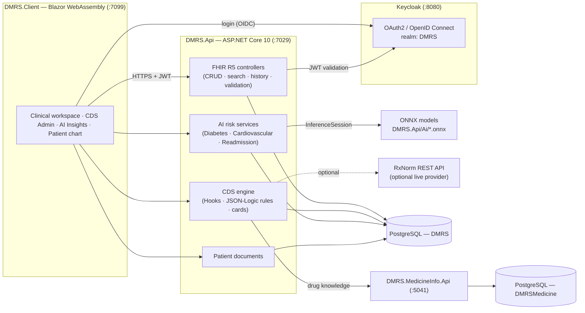
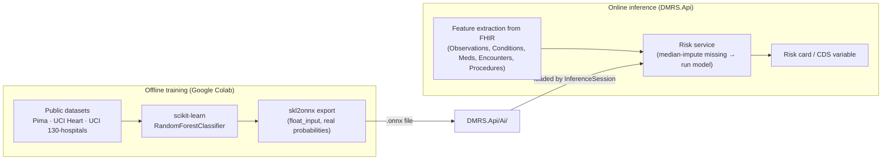
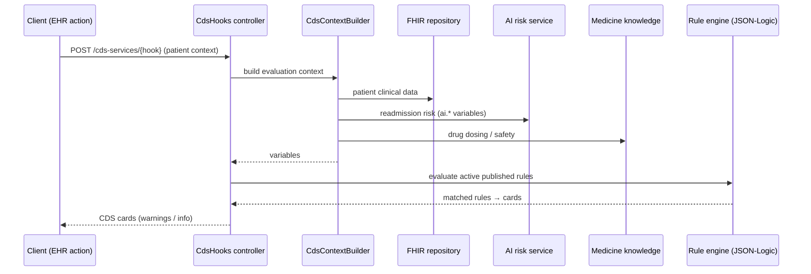
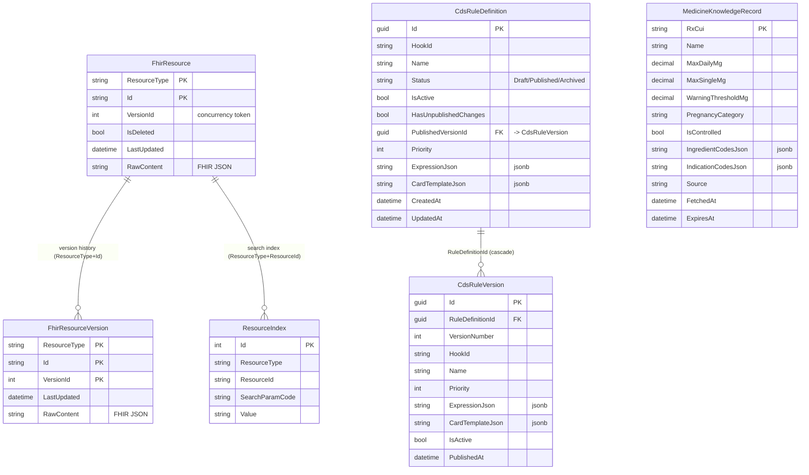
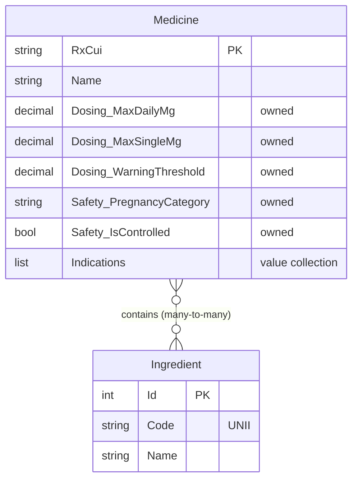

# DMRS — Architecture & Data Model

Diagrams for the report and defense. They render automatically on GitHub (Mermaid).

---

## 1. System architecture

The API stores every FHIR resource as raw JSON plus a denormalized search index, secures access with
Keycloak-issued JWTs, and enriches CDS evaluation with both medicine knowledge and the AI risk scores.

---

## 2. AI model pipeline (training → inference)

Models are trained on a **reduced feature set** — only the columns DMRS can recover from a patient's
FHIR record — so inference uses real patient data. Missing features are median-imputed and flagged.

---

## 3. CDS Hook evaluation flow

---

## 4. ERD — `DMRS` database (main API)

**Notes**
- `FhirResource`/`FhirResourceVersion`/`ResourceIndex` relationships are **logical** (matched on
  `ResourceType` + id) — no enforced foreign keys, which keeps the generic FHIR store flexible.
- `CdsRuleDefinition.PublishedVersionId` also points at the published `CdsRuleVersion` (FK, set-null on delete).
- `MedicineKnowledgeRecord` is a time-bounded cache (`FetchedAt`/`ExpiresAt`) of drug knowledge.

---

## 5. ERD — `DMRSMedicine` database (DMRS.MedicineInfo.Api)

**Notes**
- `Dosing` and `Safety` are EF Core **owned types** — flattened into columns on the `Medicine` table.
- `Medicine` ↔ `Ingredient` is many-to-many via an EF-generated join table.

---

### Source of truth
- Main schema: `DMRS.Api/Infrastructure/Persistence/AppDbContext.cs` + `DMRS.Api/Migrations/`
- Domain entities: `DMRS.Api/Domain/` and `DMRS.MedicineInfo.Api/Domain/`
